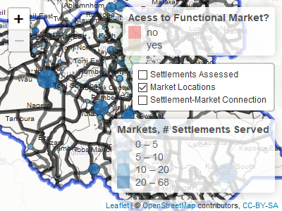

-   [Load Data](#load-data)
-   [Attach market and settlment coordinates to data
    points](#attach-market-and-settlment-coordinates-to-data-points)
-   [Clean up market assessment data](#clean-up-market-assessment-data)
-   [Spatial data wrangling](#spatial-data-wrangling)
-   [Prepare settlement and market data for
    map](#prepare-settlement-and-market-data-for-map)
-   [Leaflet Map](#leaflet-map)
-   [Display Map](#display-map)

Below is the code require to create the: [South Sudan Market
Connectivity Map](zackarno.github.io/South_Sudan_Market_Connectivity)

Load Data
=========

``` r
source("scripts/functions/colors.R")
settlement_path<-"../../ssd_aok/outputs/2020_03/settlement_lists/2020_03_working_master_settlement_list_2020_04_21.csv"
aok_feb_path<-"../../South_Sudan_Area_of_Knowledge/outputs/2020_02/aggregated_data/2020_05_04_reach_ssd_settlement_aggregated_AoK_Feb2020_Data.csv"
aok_march_path<-"../../South_Sudan_Area_of_Knowledge/outputs/2020_03/aggregated_data/2020_05_04_reach_ssd_settlement_aggregated_AoK_Mar2020_Data.csv "

#spatial data inputs
#######################################################
adm2<-st_read("../../../gis_data/gis_base/boundaries","adm2_cleaned", quiet=T) %>%
  st_transform(crs=4326)
adm2<-adm2 %>% select(ADM2_EN,everything())
adm2_center<-st_centroid(adm2) #will use this for labels
adm0<-st_read("../../../gis_data/gis_base/boundaries","ssd_admbnda_adm0_imwg_nbs_20180817", quiet=T) %>%
  st_transform(crs=4326)
adm2_lines<-st_cast(adm2,to =  "MULTILINESTRING")
landscape_db<-"../../../gis_data/gis_base/landscape"
water<-st_read(landscape_db, "ssd_Lakes_and_marshland_fao_500k", quiet=T)
rds<-st_read("../../../gis_data/gis_base/landscape","SSD_Roads", quiet=T) %>% st_transform(crs=4326)
adm_diff<-st_read("../../../gis_data/gis_base/boundaries",layer = "ssd_adm0_difference_rect",quiet=T) # will use this remove background outside ssd

# class lwd can be used to weight thickness of roads
rds<-rds %>%
  mutate(CLASS_lwd=case_when(
    CLASS=="Primary"~5,
    CLASS=="Secondary"~2,
    CLASS=="Tertiary"~1,
    TRUE~1
  )
  )
##########################################################

aok_feb<- read_csv(aok_feb_path, )
aok_march<- read_csv(aok_march_path)


aok<- bind_rows(aok_feb,aok_march)
aok<-aok %>%
  mutate(D.name_county_low=paste0(D.info_settlement,D.info_county) %>% tolower_rm_special())


settlement<-read_csv(settlement_path)
settlement<-settlement %>%
  mutate(sett_name_county_low = NAMECOUNTY %>% tolower_rm_special()) %>%
  select(NAME, NAMEJOIN,COUNTYJOIN,sett_name_county_low,sett_lon=X,sett_lat=Y)
```

Attach market and settlment coordinates to data points
======================================================

``` r
aok_with_sett_coords<-aok %>% left_join(settlement , by=c("D.name_county_low"="sett_name_county_low"))
aok_with_sett_coords %>% nrow()
```

    ## [1] 4271

``` r
#IF I USE THE FULL FEB MARCH AOK COORDS THEN IT WILL BE CLEAR WHO HAD MARKETS AND WHO DIDNT


# harmonize aok itemset iwth market gps coordinates -----------------------
aok_itemset<-readxl::read_xlsx("inputs/itemset_aok_market.xlsx","aok_itemset") %>%
  filter(name!="other") %>%
  mutate(name_county_low=paste0(label,admin_2) %>% tolower_rm_special())
markets<-readxl::read_xlsx("inputs/itemset_aok_market.xlsx","market_assesment", na = c(" ","NA")) %>%
  mutate(name_county_low=paste0(location_label,county) %>% tolower_rm_special())

# markets %>% mutate(match=ifelse(!name_county_low %in% aok_itemset$name_county_low,"no_match","match")) %>%
  # filter(match=="no_match")
```

Clean up market assessment data
===============================

-   If there are multiple markets in one settlement we can just use the
    centroid to represent the market for the purpose of this map.

-   Since we have both Feb & March data if we have the same settlement
    twice we will first select the record which has data (i.e dont
    choose the record that has “no consensus” or is blank), then we
    choose then we preferentially choose the more recently data record.

``` r
markets_unique<- markets %>%
  group_by(county, location_label, name_county_low) %>%
  summarise(
    mkt_lon=mean(coordinates_longitude,na.rm=T),
    mkt_lat= mean(coordinates_latitude,na.rm=T),
    marketplace= paste0(marketplace, collapse = ", "),
    num_marketplaces=n())


itemset_fixed<-aok_itemset %>%
  left_join(markets_unique, by="name_county_low")


# Filter duplicates to choose best answer ---------------------------------


aok_with_sett_coords %>% nrow()
```

    ## [1] 4271

``` r
aok_data_filtered<-aok_with_sett_coords %>%
  mutate(mont=ymd(month)) %>%
  group_by(D.info_county, D.info_settlement) %>%
  mutate(num=n()) %>%
  ungroup() %>%
  mutate(filter_rk= ifelse(num>1 & U.cereal_market_sett %in% c("SL","other","NC"),"remove","keep")) %>%
  filter(filter_rk=="keep") %>%
  group_by(D.info_county, D.info_settlement) %>%
  filter(month==max(month))


aok_sf<-st_as_sf(aok_data_filtered,coords=c("sett_lon","sett_lat"),crs=4326)


aok_data_filtered<- aok_data_filtered %>% 
  mutate(U.name_county_low= paste0(U.cereal_market_sett,U.cereal_market_county) %>% tolower_rm_special())


aok_data_with_mkt<-aok_data_filtered%>% filter(!U.cereal_market_sett %in% c("NC","other","SL")) %>%
  left_join(itemset_fixed, by=c("U.name_county_low"="name_county_low"))


# simplify data set a bit - take relevant columns
aok_data_with_mkt_simp<-aok_data_with_mkt %>%
  select(
    D.info_county,
    D.info_settlement,
    name_county_low,
    sett_lon,
    sett_lat,
    U.cereal_market_county,
    U.cereal_market_sett,
    U.name_county_low,
    location_label,
    mkt_lon,
    mkt_lat
  )


aok_data_with_mkt_simp<-aok_data_with_mkt_simp %>% filter(!is.na(mkt_lon))
```

Spatial data wrangling
======================

Convert data set into multi point geometry and then cast lines

``` r
# wrangle spatial data into multipoint
aok_multi_pt_gath<-aok_data_with_mkt_simp %>%
  ungroup() %>%
  mutate(lineid=row_number()) %>%
  unite(start,sett_lon,sett_lat) %>%
  unite(end, mkt_lon, mkt_lat)%>%
  gather(start_end, coords, start, end) %>%
  separate(coords, c("LONG", "LAT"), sep = "_") %>%
  mutate_at(vars(LONG, LAT), as.numeric) %>%
  st_as_sf(coords = c("LONG", "LAT")) %>%
  group_by(lineid) %>%
  summarise(sett_name=unique(D.info_settlement),market_name=unique(U.cereal_market_sett))


# cast poit set to lines
aok_lines<-aok_multi_pt_gath %>%
  filter(st_geometry_type(aok_multi_pt_gath)!="POINT") %>%
  st_cast("LINESTRING")

aok_lines<-sf::st_set_crs(aok_lines, value = 4326)
```

Prepare settlement and market data for map
==========================================

-   Make a simplified markets file which can be used to genreate
    proportional bubble dots depending on \# settlements served
-   Make labels to be used as popups/hover/tooltips
-   there is some experimenting with make custom spatial clusters which
    will change at different zooms (not implemented in current map)

``` r
mkt_simp<-aok_data_with_mkt_simp %>%
  ungroup() %>%
  group_by(U.cereal_market_county,U.cereal_market_sett, U.name_county_low) %>%
  summarise(
    number_connects=n(),
    mkt_lon=mean(mkt_lon),
    mkt_lat=mean(mkt_lat)
  )
mk_sf<-st_as_sf(mkt_simp, coords=c("mkt_lon","mkt_lat"),crs=4326)

# st_write(aok_lines,"sett_mkt_lines1.shp")


# custom clusters
cluster_group<-c("county","market")[1]
if(cluster_group=="market"){
  aok_mk_clusters<-aok_sf %>% filter(new.markets_now=="yes", !U.cereal_market_sett %in% c("NC","other")) %>%
    group_by(U.cereal_market_county,U.cereal_market_sett) %>%
    summarise(setts_per_mkt_clust=n()) %>%
    st_centroid()}
if(cluster_group=="county" ){
  aok_mk_clusters<-aok_sf %>%
    group_by(D.info_county) %>%
    summarise(setts_per_mkt_clust=n()) %>%
    st_centroid()}

aok_sf<- aok_sf %>%
  mutate(preferred_market=ifelse(U.cereal_market_sett=="SL","No market available",U.cereal_market_sett))

mk_sf$popup_text <-
  paste0('<strong>','MARKET: ', mk_sf$U.cereal_market_sett, '</strong>',
         '<br/>', '<strong>','County: ' ,' </strong>',  mk_sf$U.cereal_market_county,
         '<br/>', '<strong>','# settlements served: ','</strong>', mk_sf$number_connects,  ' ') %>%
  lapply(htmltools::HTML)
aok_sf$popup_text <-
  paste0('<strong>','SETTLEMENT: ', aok_sf$D.info_settlement, '</strong>',
         '<br/>', '<strong>','County: ' ,' </strong>',  aok_sf$D.info_county,
         '<br/>', '<strong>','Preferred Market: ','</strong>', aok_sf$preferred_market,  ' ') %>%
  lapply(htmltools::HTML)
```

Leaflet Map
===========

-   prep color ramps and bounding box
-   generate leaflet object

``` r
adm2_bbox<-st_bbox(adm2) %>% as.vector()
mkt_bins <-c(0,5, 10, 20,68)
binpal <- colorBin("Blues", mk_sf$number_connects, mkt_bins, pretty = FALSE)
catpal <- colorFactor(c(reach_colors$red, reach_colors$beige), domain = c("yes", "no"))
mkmap<-leaflet(options = leafletOptions(minZoom = 6)) %>%addTiles() %>%
  addPolygons(data=adm2, fillColor = "white", fillOpacity = 0.5,color = "black", label=~ADM2_EN) %>%
  addPolygons(data=adm_diff, fillColor = "white" , fillOpacity = 0.8) %>%
  addCircleMarkers(data=aok_sf,
                   color = "white",
                   fillColor = ~ catpal(U.market_now),
                   stroke=T,
                   weight=1.5,
                   fillOpacity = 1,
                   radius=5,
                   group="Settlements Assessed",
                   popup=~popup_text,
                   label=~popup_text,
  ) %>%
  addLegend("bottomright",
            pal= binpal,
            values = mk_sf$number_connects,
            group= "Market Locations", title="Markets, # Settlements Served") %>%
  addLegend("topright",pal = catpal, aok_sf$U.market_now, title="Acess to Functional Market?") %>%
  addPolylines(data=rds,color=reach_colors$orange,weight = ~CLASS_lwd) %>%
  addPolylines(data = aok_lines, group = "Settlement-Market Connection", fillOpacity = 0.5, color = "black", weight=3) %>%
  addPolylines(data = aok_lines, group = "Settlement-Market Connection", fillOpacity = 0.5, color = reach_colors$green, weight=2) %>%
  addCircles(data=mk_sf,color="black",
             fillColor  = ~binpal(number_connects),
             fillOpacity = 0.8,
             stroke=T,
             weight=1,
             group = "Market Locations" ,
             radius = ~(number_connects*500),
             popup = ~popup_text,
             label=~popup_text) %>%
  addLabelOnlyMarkers(data=adm2_center,
                      label = ~ADM2_EN,
                      labelOptions = labelOptions(noHide = TRUE,
                                                  direction = 'top',
                                                  textOnly = TRUE,
                                                  style=list(
                                                    "border-color"= "white"))) %>%

  setMaxBounds(lng1 = adm2_bbox[1],lat1 = adm2_bbox[2],lng2 = adm2_bbox[3],lat2 = adm2_bbox[4]) %>%
  groupOptions("Settlement-Market Connection", zoomLevels = 8:15) %>%
  # groupOptions("aok_clusters", zoomLevels = 1:7) %>%
  groupOptions("Settlements Assessed", zoomLevels = 8:15) %>%
  addLayersControl(
    overlayGroups = c("Settlements Assessed",
                      "Market Locations","Settlement-Market Connection"),
    options = layersControlOptions(collapsed = FALSE,label = "Layers",
                                   title = "Layers2")

  )
```

Display Map
===========

``` r
mkmap
```


